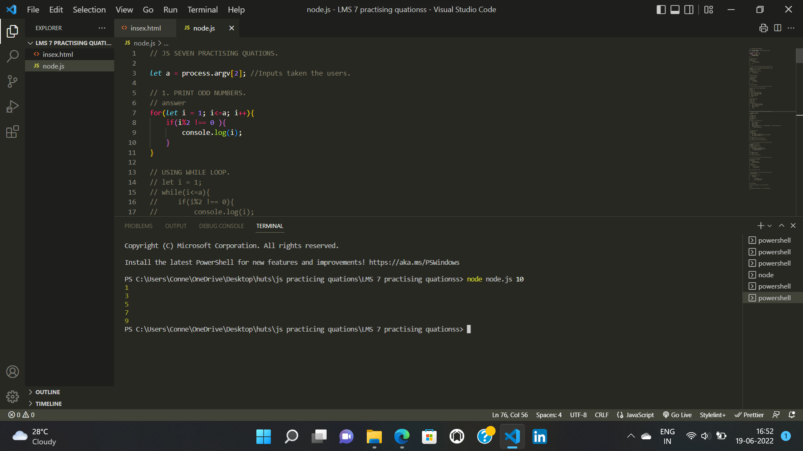
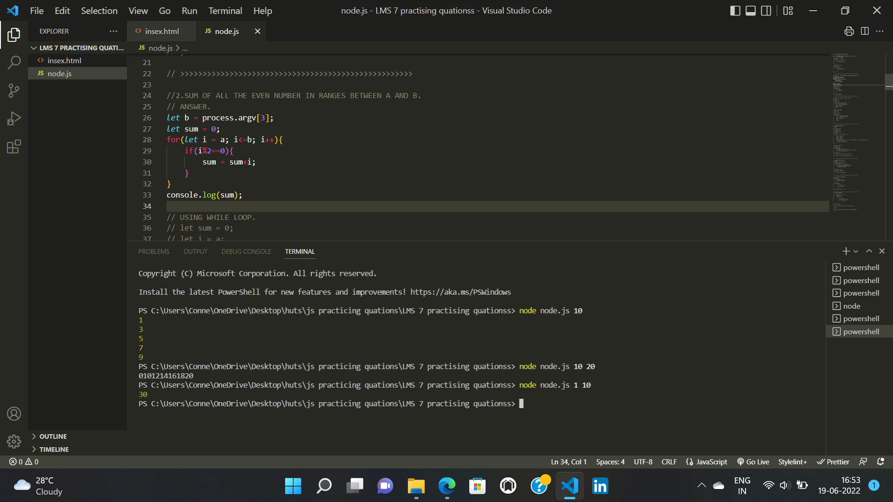
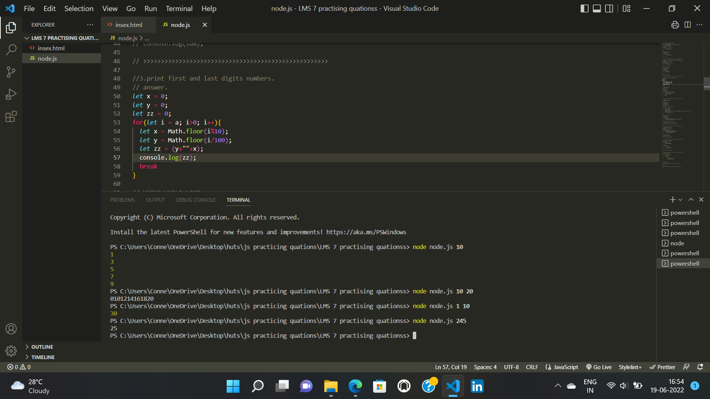
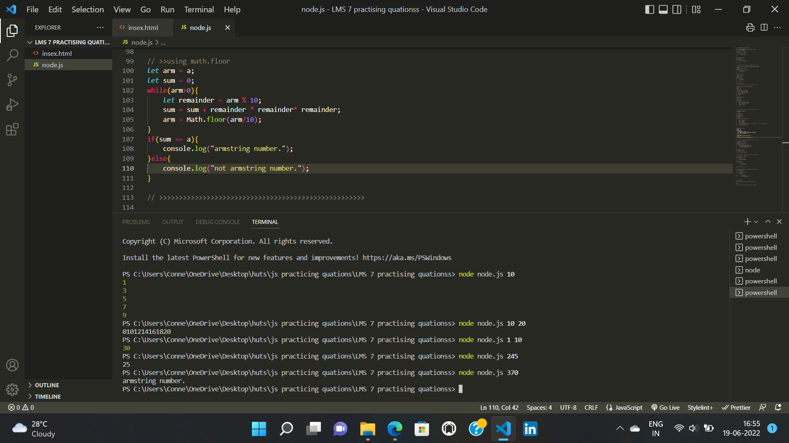
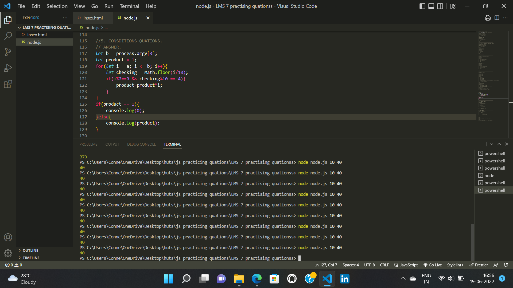
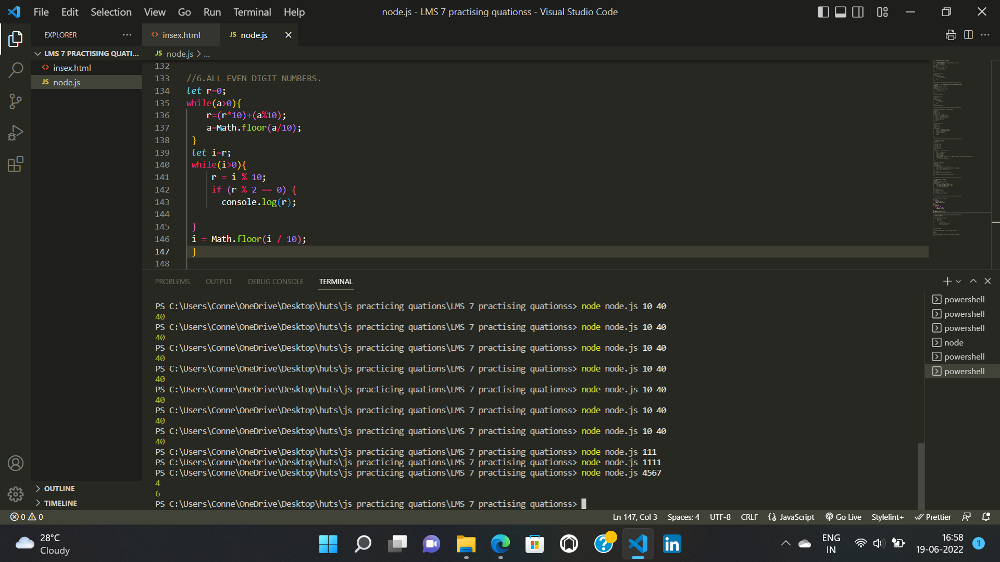
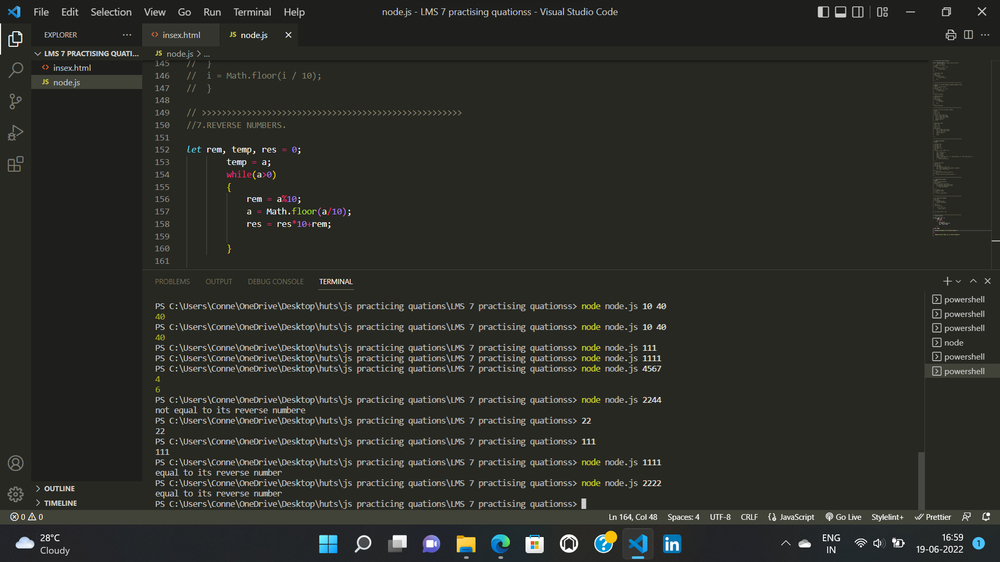

# Assignment

`1.`Using a loop print all odd numbers up to and including n. Don’t include 0.

`Out-put`

---

`2.`Print the sum of all even numbers in a range from a to b. (Including a,b)

`Out-put`

---

`3.`Write a program to read the first and last digit of a number.

`Out-put`

---

`4.`Check whether the given number is an armstrong number or not.

`Out-put`

---

`5.`Take two numbers and find product of all numbers between them that satisfy following condition (inclusive range):

- Condition 1 - Second last digit of number is 4.
- Condition 2 - Numbers should be even.

`Out-put`

---

`6.`Take a number and return all the even digits of the number.

`Out-put`

---

`7.`Check whether the given number is equal to its reverse number or not

`Out-put`

